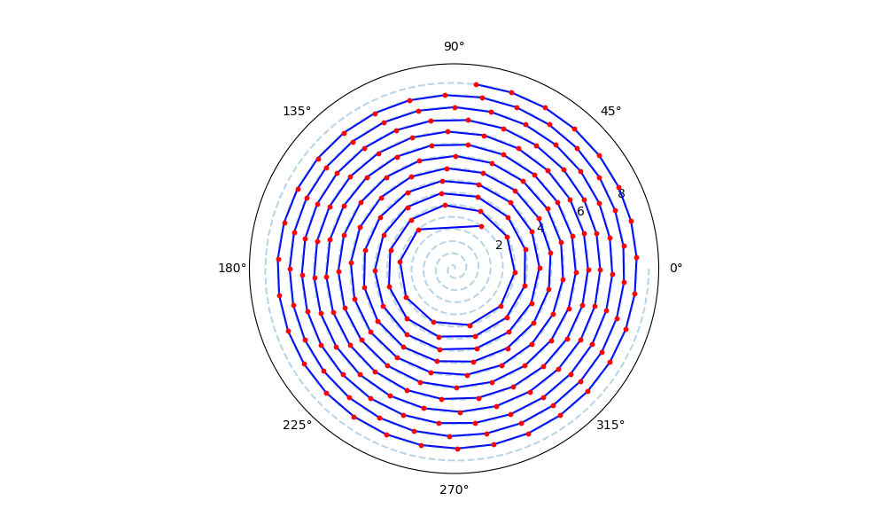
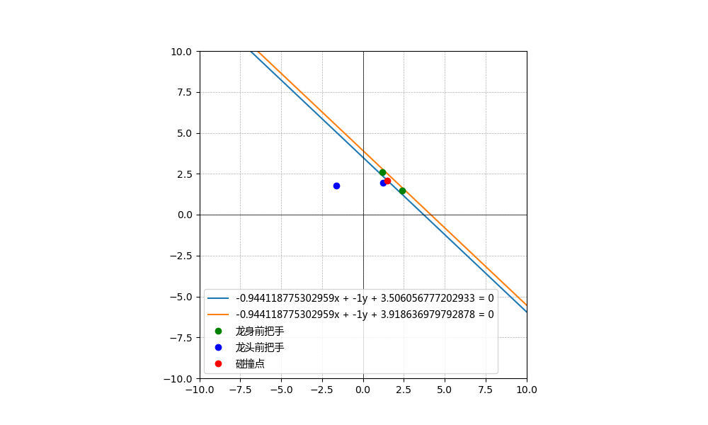
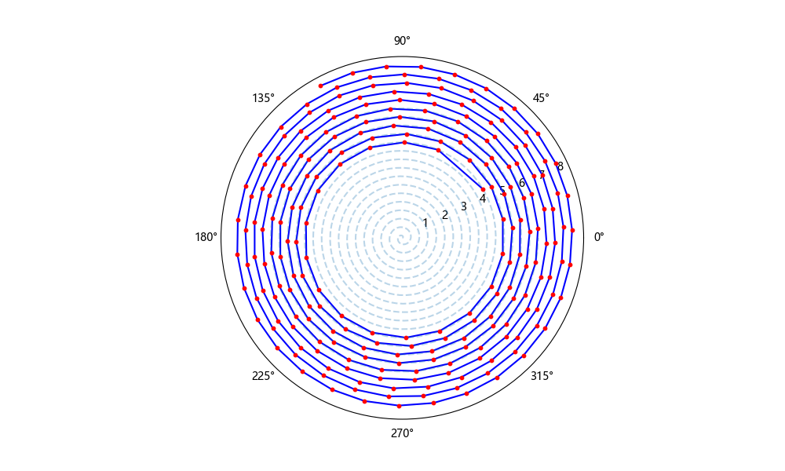
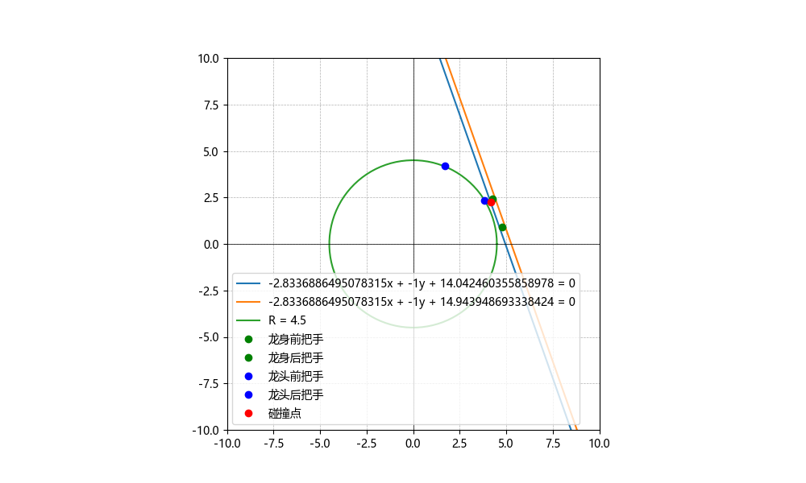

# 高教社杯2024全国大学生数学建模竞赛A题

## 项目简介

本项目基于2024年高教社杯全国大学生数学建模竞赛A题

第一、二、三问用的python，第四、五问用的matlab~

## 目录

- [第一问](./第一问/README.md)
- [第二问](./第二问/README.md)
- [第三问](./第三问/README.md)
- [第四问](./第四问/README.md)
- [第五问](./第五问/README.md)

## 一些图片展示

<table width="100%">
  <tr>
    <td style="text-align: center; width: 50%;">
      
      
第二问：碰撞时候的点列图

    </td>
    <td style="text-align: center; width: 50%;">
      
      
第二问：碰撞时候的示意图

    </td>
  </tr>
  <tr>
    <td style="text-align: center; width: 50%;">
      
      
第三问：最小螺距的点位图

    </td>
    <td style="text-align: center; width: 50%;">
      
      
第三问：最小螺距的碰撞图

    </td>
  </tr>
</table>

## 注
- 每一问的文件夹中都有 `README.md` 文件，运行代码之前请仔细阅读README文件中的提示！！！
- 为了减小支撑材料的大小，已将所有的字体文件删去，因此部分plot中将出现中文字体无法显示的情况！！！请谅解！！！

## 许可证
本项目采用 MIT 许可证。详情请参阅 [LICENSE](./LICENSE) 文件。
